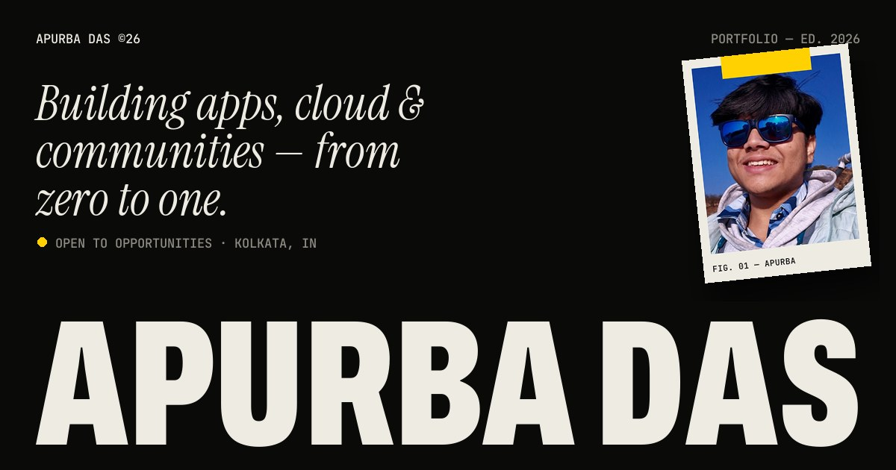

# Apurba Das — Portfolio

The personal site of Apurba Das, a full-stack and mobile developer from Kolkata.
Live at **[apurba2509-portfolio.vercel.app](https://apurba2509-portfolio.vercel.app)**.



The whole page is one idea: taking things from **zero to one**. The loader counts from `0.00` to `1.00`,
every section is numbered along the way (`0.2 Whoami` → `1.0 Contact`), and a thin yellow line across the
top fills up as you scroll towards one.

## Stack

- **React 19** + **Vite 8**
- **Tailwind CSS v4** for layout, with a small design system in `src/index.css`
- **GSAP 3** (ScrollTrigger, SplitText, ScrambleText, Draggable) for every animation
- **Lenis** for smooth scrolling
- **EmailJS** for the contact form
- Self-hosted fonts: Archivo (variable width), Instrument Serif, JetBrains Mono

## Updating the content

Everything the site says lives in **[`src/data/content.js`](src/data/content.js)**: your details, the
"Now" block, projects, the journey timeline, the tool list and social links. Edit that file and the
page updates. You shouldn't need to touch any component.

- **Add a project:** copy an entry in `projects`. Pick a `tone` (`"ink"`, `"bone"` or `"taxi"`) and a
  `poster`. The posters are drawn in code in `src/components/posters/`; reuse one or add a new
  component and register it in `posters/index.js`.
- **Smaller projects** go in `moreWork` and show up as rows under the cards.
- **Hackathons, roles, education** go in `journey`. `when` is optional.
- **Keep it fresh:** change `site.updated` whenever you update anything. It appears in the "Now"
  block and the footer.
- **Highlights:** wrap words in `*asterisks*` in `about.manifesto` to give them the yellow marker.
- **Quick answers:** questions in `faq` show up in the `0.9` section and as FAQ data for search engines.
- **Search:** `site.title` and `site.description` are what Google and AI engines show. See
  **[SEO.md](SEO.md)** for Search Console and Bing setup.

## Running it

```bash
npm install
npm run dev       # http://localhost:5173
npm run build     # production build in dist/, pre-rendered to real HTML
npm run preview   # serve the production build
npm run lint
```

## How it's put together

```
src/
├── data/content.js      # all copy and links
├── lib/                 # GSAP setup, Lenis smooth scroll, shared helpers
├── components/
│   ├── Preloader.jsx    # 0.00 → 1.00 counter and curtain
│   ├── Hero.jsx         # fitted name, draggable polaroid, stretchy letters
│   ├── About.jsx        # the zoom through the "0", words filling in
│   ├── Tapes.jsx        # crossing marquees that react to scroll speed
│   ├── Work.jsx         # stacking project cards + "Also built"
│   ├── Journey.jsx      # horizontal-scroll timeline (vertical on phones)
│   ├── Stack.jsx        # giant scrolling tool lists
│   ├── Faq.jsx          # quick answers (also published as FAQ data)
│   ├── Contact.jsx      # footer: email, socials, form
│   └── posters/         # generative artwork for each project
├── entry-server.jsx     # renders the page to HTML at build time
└── index.css            # colours, type, layout helpers
scripts/
├── seo.js               # head tags, structured data, sitemap, robots.txt, llms.txt
└── prerender.js         # writes the rendered HTML into dist/index.html
```

The build renders the whole page to static HTML, so search engines, AI crawlers and link previews see the
full content without running JavaScript. The browser then hydrates it and the animations take over.

Every scroll effect is wrapped in `gsap.matchMedia()`. Visitors who prefer reduced motion get a
static, fully readable page with no loader, pinning or smooth scrolling.

Easter egg: press **G** to see the 12-column grid.

## Deploying

The repo deploys to Vercel as a Vite project (`vercel.json` sets the build command and output
directory). Push to `main` and Vercel builds it.

## Contact

- GitHub: [@Apurba2509](https://github.com/Apurba2509)
- LinkedIn: [in/apurbadas2509](https://www.linkedin.com/in/apurbadas2509/)
- Instagram: [@\_\_\_apurbax\_\_\_](https://www.instagram.com/___apurbax___/)
